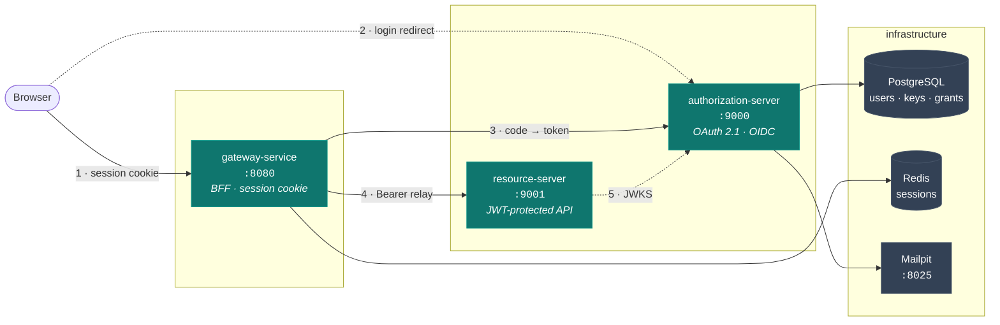
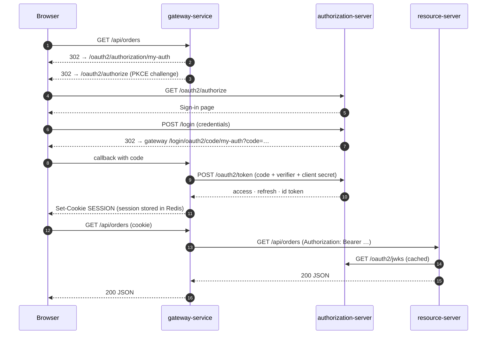

# Authorization System

> A production-shaped OAuth 2.1 / OIDC stack: a self-hosted authorization server with database-backed
> key rotation, a BFF gateway that keeps tokens out of the browser, and a resource server that gets its
> security from a reusable Spring Boot starter.

<p>
  
  
  
  
  
  
</p>

---

## Table of contents

- [What's in the box](#whats-in-the-box)
- [Architecture](#architecture)
- [Quickstart](#quickstart)
- [Docker command reference](#docker-command-reference)
- [Smoke test](#smoke-test)
- [Configuration](#configuration)
- [Running without Docker](#running-without-docker)
- [Gotchas worth knowing](#gotchas-worth-knowing)

---

## What's in the box

| Module | Port | Role |
| :-- | :-- | :-- |
| **`authorization-server`** | `9000` | OAuth 2.1 + OIDC provider. Login, registration, email verification, password reset, federated (Google) sign-in, JWK lifecycle. |
| **`gateway-service`** | `8080` | Spring Cloud Gateway acting as a **BFF**. Browser holds a session cookie, never a token; the gateway relays the access token downstream. |
| **`resource-server`** | `9001` | Sample protected API. Owns almost no security code — it consumes the starter. |
| **`myapp-security-starter`** | – | Reusable auto-configuration: audience validation, roles-claim mapping, declarative `permit-all`, stateless JWT chain. |

<details>
<summary><b>Feature detail</b></summary>

**Authorization server**
- Authorization Code + PKCE (**required**) for the web client, Client Credentials for machine-to-machine.
- Access tokens live **5 minutes**; refresh tokens **12 hours** and **rotate on every use** (`reuse-refresh-tokens: false`).
- Custom claims: `aud: my-api`, `roles`, `email`. Client-credential tokens are stamped `roles: ["SERVICE"]`.
- **JWK lifecycle in Postgres.** RSA-3072 keys generated on demand, private material encrypted at rest with
  AES-GCM (`AUTH_JWK_SECRET_KEY`), rotated through `CURRENT → NEXT → RETIRED` on a 30-day period with a
  24-hour publish-ahead and a 24-hour retirement grace. The hourly job takes a **Postgres advisory lock**, so
  running several instances is safe.
- Self-service flows: registration with **Have I Been Pwned** breach checking (fail-open), email verification
  (24 h TTL), password reset (1 h TTL). Tokens are 256-bit random values stored **only as SHA-256 hashes**.
- Federated login with account linking by verified email (`auth.federation.providers.*.link-by-email`).
- Expired authorization records are purged on a schedule (24 h retention, 1000-row batches).
- Schema is owned by **Liquibase**; JPA runs with `ddl-auto: validate`.

**Gateway (BFF pattern)**
- `oauth2Login` + **Spring Session in Redis**, so the browser only ever sees an opaque `SESSION` cookie.
- `TokenRelay` attaches the access token to downstream calls and `RemoveRequestHeader=Cookie` strips the
  session on the way out.
- CSRF token published as a JS-readable `XSRF-TOKEN` cookie.
- `/api/**` and `/user` answer **401** instead of redirecting — correct for `fetch()`; everything else
  redirects to the login page.
- RP-initiated logout returns the user to the gateway root.

**Security starter**
- Contributes an **audience validator** (not a `JwtDecoder`) so it composes with Boot's own decoder
  auto-configuration instead of racing it.
- `myapp.security.permit-all` is a `method → paths` map; an unknown method name fails fast rather than
  silently registering a matcher that never matches.
- Every bean is `@ConditionalOnMissingBean` — override any single piece without forking the starter.

</details>

---

## Architecture



<details>
<summary><b>Login sequence</b></summary>



</details>

---

## Quickstart

### Prerequisites

- Docker Desktop (Compose v2.30+ — the `env_file` `format: raw` option is required)
- A `.env` file in the repository root (not committed — see [Configuration](#configuration))

### Run everything

```bash
docker compose --profile apps up -d --build
```

First build pulls the JDK image and downloads the Gradle distribution plus dependencies; subsequent
builds reuse a BuildKit cache mount and take seconds. Compose starts services in dependency order and
waits on real health checks, so when the command returns, the stack is genuinely ready.

```
✔ postgres   healthy   → authorization-server   healthy
                        → resource-server        started
                        → gateway-service        started
✔ redis      healthy   ↗
```

### Open it

| URL | What you get |
| :-- | :-- |
| <http://localhost:8080> | **Start here.** The gateway; any request bounces you into the login flow. |
| <http://kubernetes.docker.internal:9000> | Authorization server — sign-in, registration, password reset |
| <http://kubernetes.docker.internal:9000/.well-known/openid-configuration> | OIDC discovery document |
| <http://localhost:9001/api/public/ping> | Resource server, unauthenticated endpoint |
| <http://localhost:8025> | Mailpit — every verification and reset mail lands here |

> [!IMPORTANT]
> The issuer host is `kubernetes.docker.internal`, **not** `localhost`. The `iss` claim is compared
> verbatim by all three services, so one hostname has to resolve identically for your browser and inside
> the container network. Docker Desktop already maps this name to `127.0.0.1` on the host, and a compose
> network alias points it at the authorization-server container. See
> [Gotchas](#gotchas-worth-knowing) for why `host.docker.internal` does not work here.

### First run, end to end

1. Open <http://localhost:8080> → you land on the sign-in page.
2. Click through to **Register**, submit an email, display name and a 12+ character password.
3. Open <http://localhost:8025>, click the confirmation link in the mail.
4. Sign in. You are redirected back to the gateway.
5. Hit <http://localhost:8080/api/orders> — orders come back through the token relay.
6. Hit <http://localhost:8080/user> — your identity, as the gateway sees it.

---

## Docker command reference

### Everyday

```bash
# infrastructure only (postgres + redis + mailpit) -- what the IDE workflow uses
docker compose up -d

# the whole system, rebuilding any changed module
docker compose --profile apps up -d --build

# what is running, and is it healthy
docker compose --profile apps ps

# follow the logs of one service
docker compose logs -f authorization-server

# stop everything, keep the database
docker compose --profile apps down

# stop everything and wipe the database volume
docker compose --profile apps down -v
```

> [!NOTE]
> The three applications sit behind the **`apps` profile** on purpose. A bare `docker compose up -d`
> starts only infrastructure, so `spring-boot-docker-compose` — which the authorization server brings up
> automatically when you run it from your IDE — cannot collide with a containerized copy of itself.

### Iterating on one service

```bash
# rebuild + restart a single app
docker compose --profile apps up -d --build gateway-service

# force a clean build (ignores the layer cache)
docker compose --profile apps build --no-cache resource-server

# restart without rebuilding
docker compose restart gateway-service
```

### Poking at the infrastructure

```bash
# psql into the auth database
docker compose exec postgres psql -U auth-user -d auth

# what has Liquibase applied?
docker compose exec postgres psql -U auth-user -d auth -c "select id, dateexecuted from databasechangelog order by orderexecuted;"

# signing keys and their lifecycle state
docker compose exec postgres psql -U auth-user -d auth -c "select kid, status, created_at from signing_keys order by created_at desc;"

# live sessions in Redis
docker compose exec redis redis-cli --scan --pattern 'may-app:session:*'

# resolved configuration, fully merged
docker compose --profile apps config
```

### Housekeeping

```bash
# tail everything at once
docker compose --profile apps logs -f --tail=50

# disk reclaim after many rebuilds
docker builder prune
```

---

## Smoke test

Copy-paste checks that exercise every moving part.

**Discovery document reports the right issuer**

```bash
curl -s http://kubernetes.docker.internal:9000/.well-known/openid-configuration | jq .issuer
# "http://kubernetes.docker.internal:9000"
```

**Machine-to-machine token, then call the API with it**

```bash
TOKEN=$(curl -s -u "orders-service:$ORDERS_M2M_SECRET" \
  -d grant_type=client_credentials -d scope=internal.read \
  http://localhost:9000/oauth2/token | jq -r .access_token)

curl -s -o /dev/null -w '%{http_code}\n' -H "Authorization: Bearer $TOKEN" \
  http://localhost:9001/api/orders     # 200

curl -s -o /dev/null -w '%{http_code}\n' http://localhost:9001/api/orders   # 401
```

*(`ORDERS_M2M_SECRET` is the plaintext counterpart of `ORDERS_M2M_SECRET_BCRYPT`, documented in `.env`.)*

**The public endpoint stays open**

```bash
curl -s http://localhost:9001/api/public/ping
# {"service":"resource-server","status":"ok"}
```

**The gateway sends you to the issuer, with PKCE**

```bash
curl -si http://localhost:8080/oauth2/authorization/my-auth | grep -i '^location'
# location: http://kubernetes.docker.internal:9000/oauth2/authorize?…&code_challenge_method=S256
```

---

## Configuration

Every value the containers need comes from **`.env` in the repository root**, with container-specific
overrides applied in `compose.yaml` (`environment:` beats `env_file:`). Secrets stay in `.env`; only
host names and ports are overridden.

| Variable | Consumed by | Notes |
| :-- | :-- | :-- |
| `AUTHORIZATION_ISSUER` | all three | Must be byte-identical everywhere. Compose overrides it to `http://kubernetes.docker.internal:9000`. |
| `GATEWAY_BASE_URL` | authorization-server | Derives the registered redirect and post-logout URIs. |
| `DB_URL` / `DB_USERNAME` / `DB_PASSWORD` | authorization-server | Overridden to `postgres:5432` in compose. |
| `GATEWAY_CLIENT_SECRET_BCRYPT` | authorization-server | bcrypt hash **without** the `{bcrypt}` prefix. |
| `GATEWAY_CLIENT_SECRET` | gateway-service | Plaintext counterpart — keep the two in sync. |
| `ORDERS_M2M_SECRET_BCRYPT` | authorization-server | Client-credentials client. |
| `AUTH_JWK_SECRET_KEY` | authorization-server | Base64 of 16/24/32 raw bytes. **Changing it makes every stored JWK undecryptable.** |
| `GOOGLE_CLIENT_ID` / `GOOGLE_CLIENT_SECRET` | authorization-server | Placeholders are resolved eagerly — the app will not start if unset. |
| `SMTP_*` / `MAIL_FROM` | authorization-server | Compose points SMTP at the Mailpit container. |
| `REDIS_HOST` / `REDIS_PORT` | gateway-service | See the Redis note in [Gotchas](#gotchas-worth-knowing). |
| `ORDERS_SERVICE_URL` | gateway-service | Downstream target of the `/api/orders/**` route. |

Regenerate the throwaway local secrets with:

```bash
openssl rand -base64 32            # AUTH_JWK_SECRET_KEY
openssl rand -hex 24               # a client secret (hash it with bcrypt for the server side)
```

---

## Running without Docker

The four Gradle projects are independent builds — there is no aggregator project. `resource-server`
composes `myapp-security-starter` through `includeBuild '../myapp-security-starter'`, so it needs no
separate publish step.

```bash
docker compose up -d                                    # infrastructure only

cd authorization-server && ./gradlew bootRun --args='--spring.profiles.active=local'
cd gateway-service      && ./gradlew bootRun --args='--spring.profiles.active=local'
cd resource-server      && ./gradlew bootRun --args='--spring.profiles.active=local'
```

The `local` profile sets the ports (`9000` / `8080` / `9001`) and points mail at Mailpit on
`localhost:1025`. In this mode `AUTHORIZATION_ISSUER=http://localhost:9000` from `.env` is correct,
because every process shares the host's loopback.

---

## Gotchas worth knowing

<details open>
<summary><b>The issuer hostname cannot be <code>localhost</code> under Docker</b></summary>

`localhost` inside the gateway container means *the gateway*, so OIDC discovery would fail; but the
issuer string is also what the browser must be redirected to. One name has to satisfy both.

`host.docker.internal` is the usual answer and **does not work on this setup** — Docker Desktop maps it
to the VM address (`192.168.249.10`), which containers can reach but the Windows host cannot; the login
page would be unreachable from the browser. `kubernetes.docker.internal` is mapped to `127.0.0.1` in the
host's `hosts` file, and a compose network alias makes it resolve to the authorization-server container
from inside the network. Both directions work.

A tidier alternative, if you do not mind an Administrator edit once: add `127.0.0.1 auth-server` to
`C:\Windows\System32\drivers\etc\hosts`, then swap the alias and `AUTHORIZATION_ISSUER` to
`http://auth-server:9000`.

</details>

<details>
<summary><b>Redis host/port are configured under the wrong prefix</b></summary>

`gateway-service/src/main/resources/application.yaml` puts `host` and `port` under
`spring.session.data.redis.*`. That subtree only carries `namespace` — the Lettuce **connection** is
configured by `spring.data.redis.*`. The two properties are silently ignored and the client falls back to
`localhost:6379`, which happens to be correct when you run on the host and fails hard in a container.

`compose.yaml` works around it with `SPRING_DATA_REDIS_HOST` / `SPRING_DATA_REDIS_PORT`. The real fix is
to move host and port under `spring.data.redis` and leave `namespace` where it is.

</details>

<details>
<summary><b>bcrypt hashes vs. Docker Compose interpolation</b></summary>

A bcrypt hash starts with `$2a$10$…`, and Compose's dotenv parser expands `$rT8E…` as a variable
reference — silently corrupting the hash. The app services therefore attach `.env` as:

```yaml
env_file:
  - path: .env
    format: raw
```

Compose still parses `.env` separately for its own interpolation and prints
`The "rT8E" variable is not set` on every command. That warning is **cosmetic**: with `format: raw` the
containers receive the hashes intact. To silence it, single-quote the hash values in `.env` and drop
`format: raw`.

</details>

<details>
<summary><b>Mail settings differ between host and container</b></summary>

`application.yaml` requires SMTP auth and STARTTLS; Mailpit offers neither. The `local` profile handles
this for host runs, but it also hardcodes `spring.mail.host: localhost`, which is wrong in a container —
so containers do **not** activate `local`. `compose.yaml` relaxes the three
`SPRING_MAIL_PROPERTIES_MAIL_SMTP_*` flags instead.

</details>

<details>
<summary><b>Building <code>resource-server</code> needs the repository root as context</b></summary>

Because of the `includeBuild`, `resource-server/Dockerfile` is built with `context: .` and copies both
`myapp-security-starter/` and `resource-server/`. Build it with `docker compose build resource-server`,
not `docker build resource-server/`.

</details>
