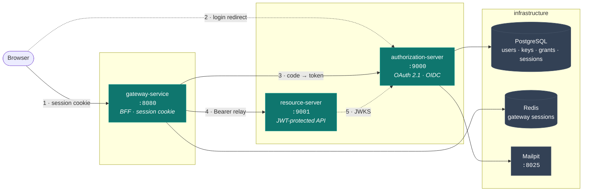
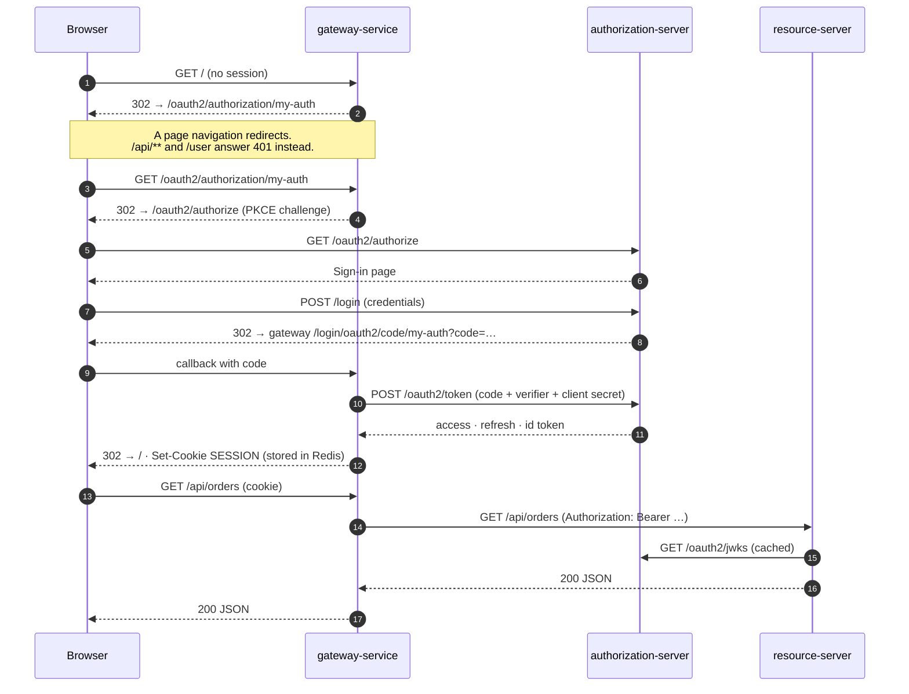

# Authorization System

> A production-shaped OAuth 2.1 / OIDC stack: a self-hosted authorization server with database-backed
> key rotation, a BFF gateway that keeps tokens out of the browser, and a resource server that gets its
> security from a reusable Spring Boot starter.

<p>
  
  
  
  
  
  
</p>

---

## Table of contents

- [What's in the box](#whats-in-the-box)
- [Architecture](#architecture)
- [Quickstart](#quickstart)
- [Infrastructure command reference](#infrastructure-command-reference)
- [Smoke test](#smoke-test)
- [Configuration](#configuration)
- [Gotchas worth knowing](#gotchas-worth-knowing)

---

## What's in the box

| Module | Port | Role |
| :-- | :-- | :-- |
| **`authorization-server`** | `9000` | OAuth 2.1 + OIDC provider. Login, registration, email verification, password reset, federated (Google) sign-in, JWK lifecycle. |
| **`gateway-service`** | `8080` | Spring Cloud Gateway acting as a **BFF**. Browser holds a session cookie, never a token; the gateway relays the access token downstream. |
| **`resource-server`** | `9001` | Sample protected API. Owns almost no security code — it consumes the starter. |
| **`myapp-security-starter`** | – | Reusable auto-configuration: audience validation, roles-claim mapping, declarative `permit-all`, stateless JWT chain. |

<details>
<summary><b>Feature detail</b></summary>

**Authorization server**
- Authorization Code + PKCE (**required**) for the web client.
- Access tokens live **5 minutes**; refresh tokens **12 hours** and **rotate on every use** (`reuse-refresh-tokens: false`).
- Custom claims: `aud: my-api`, `roles`, `email`.
- **JWK lifecycle in Postgres.** RSA-3072 keys generated on demand, private material encrypted at rest with
  AES-GCM (`AUTH_JWK_SECRET_KEY`), rotated through `CURRENT → NEXT → RETIRED` on a 30-day period with a
  24-hour publish-ahead and a 24-hour retirement grace. The hourly job takes a **Postgres advisory lock**, so
  running several instances is safe.
- Self-service flows: registration with **Have I Been Pwned** breach checking (fail-open), email verification
  (24 h TTL), password reset (1 h TTL). Tokens are 256-bit random values stored **only as SHA-256 hashes**.
- Federated login with account linking by verified email (`auth.federation.providers.*.link-by-email`).
- Expired authorization records are purged on a schedule (24 h retention, 1000-row batches).
- **SSO session in Postgres** via Spring Session JDBC, **8 h idle** and a **14-day absolute cap**
  (`auth.session.max-lifetime`) so an always-active browser cannot hold one open forever. The login
  session outlives a restart and is shared across instances; the `AUTH_SESSION` cookie is `HttpOnly`
  + `SameSite=Lax`, and `Secure` everywhere except the `local` profile.
- Schema is owned by **Liquibase**; JPA runs with `ddl-auto: validate`.

**Gateway (BFF pattern)**
- `oauth2Login` + **Spring Session in Redis**, so the browser only ever sees an opaque `SESSION` cookie
  — `HttpOnly` + `SameSite=Lax`, and `Secure` outside the `local` profile.
- `TokenRelay` attaches the access token to downstream calls and `RemoveRequestHeader=Cookie` strips the
  session on the way out.
- CSRF token published as a JS-readable `XSRF-TOKEN` cookie.
- `/api/**` and `/user` answer **401** instead of redirecting — correct for `fetch()`; everything else
  redirects to the login page.
- RP-initiated logout returns the user to the gateway root.

**Security starter**
- Contributes an **audience validator** (not a `JwtDecoder`) so it composes with Boot's own decoder
  auto-configuration instead of racing it.
- `myapp.security.permit-all` is a `method → paths` map; an unknown method name fails fast rather than
  silently registering a matcher that never matches.
- Every bean is `@ConditionalOnMissingBean` — override any single piece without forking the starter.

</details>

---

## Architecture



<details>
<summary><b>Login sequence</b></summary>



</details>

---

## Quickstart

### Prerequisites

- JDK 25
- Docker Desktop — for the **infrastructure only**. The three applications run as ordinary Java
  processes on your machine; nothing about them is containerized.
- A `.env` file in the repository root (not committed — see [Configuration](#configuration))

### 1. Start the infrastructure

```bash
docker compose up -d
```

Postgres, Redis and Mailpit, each with a health check. Nothing else lives in `compose.yaml`.

### 2. Build the three applications

The four Gradle projects are independent builds — there is no aggregator project. `resource-server`
composes `myapp-security-starter` through `includeBuild '../myapp-security-starter'`, so it needs no
separate publish step.

```bash
(cd authorization-server && ./gradlew bootJar)
(cd resource-server      && ./gradlew bootJar)
(cd gateway-service      && ./gradlew bootJar)
```

### 3. Run them

Load `.env` into the environment, then start each jar with the `local` profile.

> [!IMPORTANT]
> **Start the authorization server first and let it finish booting.** The gateway resolves the OIDC
> discovery document at startup, so it exits with `Unable to resolve Configuration with the provided
> Issuer` if nothing is listening on `:9000` yet. See [Gotchas](#gotchas-worth-knowing).

**PowerShell**

```powershell
Get-Content .env | Where-Object { $_ -and $_ -notmatch '^\s*#' } | ForEach-Object {
    $name, $value = $_ -split '=', 2
    [Environment]::SetEnvironmentVariable($name, $value)
}

Start-Process java '-jar','authorization-server/build/libs/authorization-server-0.0.1-SNAPSHOT.jar','--spring.profiles.active=local'
# wait until http://localhost:9000/.well-known/openid-configuration answers, then:
Start-Process java '-jar','resource-server/build/libs/resource-server-0.0.1-SNAPSHOT.jar','--spring.profiles.active=local'
Start-Process java '-jar','gateway-service/build/libs/gateway-service-0.0.1-SNAPSHOT.jar','--spring.profiles.active=local'
```

**bash**

```bash
# do NOT `source .env` -- the bcrypt hashes contain $ and the shell would mangle them
while IFS= read -r line; do
  case "$line" in ''|'#'*) continue;; esac
  export "${line%%=*}=${line#*=}"
done < .env

java -jar authorization-server/build/libs/authorization-server-0.0.1-SNAPSHOT.jar --spring.profiles.active=local &
until curl -sf http://localhost:9000/.well-known/openid-configuration > /dev/null; do sleep 1; done
java -jar resource-server/build/libs/resource-server-0.0.1-SNAPSHOT.jar --spring.profiles.active=local &
java -jar gateway-service/build/libs/gateway-service-0.0.1-SNAPSHOT.jar --spring.profiles.active=local &
```

From an IDE, run each `*Application` class with `--spring.profiles.active=local` and `.env` loaded —
same thing, same ordering rule. `./gradlew bootRun --args='--spring.profiles.active=local'` works too,
and on the authorization server it additionally starts `compose.yaml` for you through
`spring-boot-docker-compose`.

### Shut down

```bash
# stop the applications
#   PowerShell:  Get-Process java | Stop-Process
#   bash:        kill %1 %2 %3      (or: pkill -f 'spring.profiles.active=local')

docker compose down       # stop the infrastructure, keep the database
docker compose down -v    # stop it and wipe the database volume
```

### Open it

| URL | What you get |
| :-- | :-- |
| <http://localhost:8080> | **Start here.** The gateway; any request bounces you into the login flow. |
| <http://localhost:9000> | Authorization server — sign-in, registration, password reset |
| <http://localhost:9000/.well-known/openid-configuration> | OIDC discovery document |
| <http://localhost:9001/api/public/ping> | Resource server, unauthenticated endpoint |
| <http://localhost:8025> | Mailpit — every verification and reset mail lands here |

> [!IMPORTANT]
> The issuer is `http://localhost:9000` and every service — browser, gateway, resource server — reaches
> it at that one address. It is the `iss` claim, the URL your browser is redirected to, and the host in
> the Google redirect URI, which Google only accepts over plain `http://` for `localhost`. Keeping the
> applications off Docker is what lets a single address satisfy all of them.

### First run, end to end

1. Open <http://localhost:8080> → you land on the sign-in page.
2. Click through to **Register**, submit an email, display name and a 12+ character password.
3. Open <http://localhost:8025>, click the confirmation link in the mail.
4. Sign in. You are redirected back to the gateway.
5. Hit <http://localhost:8080/api/orders> — orders come back through the token relay.
6. Hit <http://localhost:8080/user> — your identity, as the gateway sees it.

---

## Infrastructure command reference

Everything here targets the three backing services. The applications are plain Java processes — they
have no `docker compose` verbs.

```bash
# start / stop
docker compose up -d
docker compose down          # keep the database
docker compose down -v       # wipe the database volume too

# what is running, and is it healthy
docker compose ps

# follow the logs of one service
docker compose logs -f postgres
```

### Poking at the infrastructure

```bash
# psql into the auth database
docker compose exec postgres psql -U auth-user -d auth

# what has Liquibase applied?
docker compose exec postgres psql -U auth-user -d auth -c "select id, dateexecuted from databasechangelog order by orderexecuted;"

# signing keys and their lifecycle state
docker compose exec postgres psql -U auth-user -d auth -c "select kid, status, created_at from signing_keys order by created_at desc;"

# live sessions in Redis
docker compose exec redis redis-cli --scan --pattern 'may-app:session:*'

# resolved configuration, fully merged
docker compose config
```

## Smoke test

Copy-paste checks that exercise every moving part.

**Discovery document reports the right issuer**

```bash
curl -s http://localhost:9000/.well-known/openid-configuration | jq .issuer
# "http://localhost:9000"
```

**The protected API rejects an anonymous call**

```bash
curl -s -o /dev/null -w '%{http_code}\n' http://localhost:9001/api/orders   # 401
```

**The public endpoint stays open**

```bash
curl -s http://localhost:9001/api/public/ping
# {"service":"resource-server","status":"ok"}
```

**The gateway sends you to the issuer, with PKCE**

```bash
curl -si http://localhost:8080/oauth2/authorization/my-auth | grep -i '^location'
# location: http://localhost:9000/oauth2/authorize?…&code_challenge_method=S256
```

---

## Configuration

Configuration is split in two, along one line: **where things are** goes in a Spring profile, **what
must stay secret** goes in `.env`.

| Profile | Activated by | What it sets |
| :-- | :-- | :-- |
| `local` | `--spring.profiles.active=local` | The server port, and the session cookie's `Secure` flag, which nothing local can satisfy over plain http |

Each module has two files. `application.yaml` holds the full configuration, with every address coming
from an environment variable — `${DB_URL}`, `${REDIS_HOST}`, `${AUTHORIZATION_ISSUER}` and friends, all
resolved from `.env`. `application-local.yaml` holds only what an environment variable cannot express:
the listen port, and `server.*.session.cookie.secure: false`. That last one is the only setting that is
*less* safe locally than in the base file — cookies are `Secure` by default and the local profile has to
opt out, rather than the other way round, so forgetting to configure an environment cannot silently ship
a session cookie that travels over plain http. No new `.env` variable was needed for any of it.

Addresses therefore appear exactly once, in `.env`. Point `DB_URL` at another database and nothing else
has to change. `compose.yaml` carries no application configuration at all; it only defines the three
backing services.

Placeholders such as `${AUTHORIZATION_ISSUER}` are written **without** defaults on purpose: a missing
value fails the startup loudly instead of quietly booting against a fallback that happens to be wrong.

| Variable | Consumed by | Notes |
| :-- | :-- | :-- |
| `AUTHORIZATION_ISSUER` | all three | The issuer, `http://localhost:9000`. Compared verbatim, so it must be byte-identical everywhere. |
| `GATEWAY_BASE_URL` | authorization-server | Derives the registered redirect and post-logout URIs. |
| `DB_URL` / `DB_USERNAME` / `DB_PASSWORD` | authorization-server | Schema is owned by Liquibase; JPA runs `ddl-auto: validate`. |
| `GATEWAY_CLIENT_SECRET_BCRYPT` | authorization-server | bcrypt hash **without** the `{bcrypt}` prefix. |
| `GATEWAY_CLIENT_SECRET` | gateway-service | Plaintext counterpart — keep the two in sync. |
| `AUTH_JWK_SECRET_KEY` | authorization-server | Base64 of 16/24/32 raw bytes. **Changing it makes every stored JWK undecryptable.** |
| `GOOGLE_CLIENT_ID` / `GOOGLE_CLIENT_SECRET` | authorization-server | Placeholders are resolved eagerly — the app will not start if unset. |
| `SMTP_*` / `MAIL_FROM` | authorization-server | Points at Mailpit; the `local` profile switches SMTP auth and STARTTLS off. |
| `REDIS_HOST` / `REDIS_PORT` | gateway-service | Spring Session store. See the Redis note in [Gotchas](#gotchas-worth-knowing). |
| `ORDERS_SERVICE_URL` | gateway-service | Downstream target of the `/api/orders/**` route. |

> [!WARNING]
> Environment variables outrank profile YAML in Spring Boot. Putting `SPRING_DATA_REDIS_HOST` (or any
> other relaxed-binding name of a property the profile sets) into `.env` silently wins over the profile.

Regenerate the throwaway local secrets with:

```bash
openssl rand -base64 32            # AUTH_JWK_SECRET_KEY
openssl rand -hex 24               # a client secret (hash it with bcrypt for the server side)
```

---

## Gotchas worth knowing

<details>
<summary><b>Session timeouts are idle timeouts, and nothing caps them for you</b></summary>

`spring.session.timeout` resets on every request that touches the session, so 8 h means "8 h of
inactivity", not "8 h". A browser that keeps polling holds an SSO session — the credential that mints
tokens for every client — open indefinitely. Spring Session has no absolute cap either: `Session`
exposes `getCreationTime()` and `getMaxInactiveInterval()`, and only the latter is enforced.

`SessionMaxLifetimeFilter` closes that gap by comparing `getCreationTime()` against
`auth.session.max-lifetime`. It is registered at `DEFAULT_FILTER_ORDER - 1`, in the gap between Spring
Session resolving the session and Spring Security reading the `SecurityContext` out of it — one slot
later and an over-age session would still authenticate the request it was caught on.

No cleanup job is needed for the rows: an over-age session is deleted the moment it is next used, and
one that is never used again expires on the idle timeout instead.

</details>

<details>
<summary><b><code>SameSite=Strict</code> silently breaks the authorization server</b></summary>

`Strict` is the instinctive "most secure" choice and it is the wrong one here. It withholds the cookie
on **all** cross-site navigations, including top-level ones, and two of this system's hops are exactly
that:

1. The gateway redirects the browser to `/oauth2/authorize`. Without the session cookie the
   authorization server sees an anonymous user and re-prompts for login on every authorization — SSO
   quietly stops working.
2. Google redirects back to `{issuer}/login/oauth2/code/google`. That request needs the
   `OAUTH2_AUTHORIZATION_REQUEST` attribute from the session to validate `state` and `nonce`, so
   federated login fails outright with `authorization_request_not_found`.

`Lax` **is** sent on top-level cross-site GET navigations, which is what both of those are. It is the
correct value, not a compromise. `None` would only be needed for iframe-based silent renewal, which
the BFF pattern makes unnecessary.

</details>

<details>
<summary><b>Two apps on <code>localhost</code> cannot both use the <code>SESSION</code> cookie</b></summary>

Cookies are scoped by host and **ignore the port**, so `localhost:9000` and `localhost:8080` share one
cookie jar. Spring Session's default cookie name is `SESSION` for both the servlet and the reactive
stack, so the moment the authorization server adopted Spring Session it would have started overwriting
the gateway's session cookie, and vice versa — presenting as a login loop with no obvious cause.

Hence `server.servlet.session.cookie.name: AUTH_SESSION` on the authorization server. This is the one
case where renaming a session cookie is not security-by-obscurity: it is collision avoidance.

</details>

<details>
<summary><b>MockMvc cannot verify session cookie configuration</b></summary>

Boot builds the `DefaultCookieSerializer` in two mutually exclusive branches:
`@ConditionalOnNotWarDeployment` reads `server.servlet.session.cookie.*`, while
`@ConditionalOnWarDeployment` reads the settings off the `ServletContext` instead. That condition
matches whenever the context is a `WebApplicationContext` with a non-null `ServletContext` — which is
true for `MockServletContext`, and therefore for every `webEnvironment = MOCK` test.

So a MockMvc test of the session cookie asserts against framework defaults and never sees your
configuration at all. `SessionPersistenceTests` uses `webEnvironment = RANDOM_PORT` for this reason.
A real embedded run takes the other branch because the servlet context does not exist yet when
conditions are evaluated.

</details>

<details open>
<summary><b>Start the authorization server before the gateway</b></summary>

`spring.security.oauth2.client.provider.my-auth.issuer-uri` makes Boot fetch
`/.well-known/openid-configuration` **while the context is being built**. If the authorization server
is not listening yet, the gateway does not retry or degrade — it fails to start:

```
Unable to resolve Configuration with the provided Issuer of "http://localhost:9000"
Caused by: I/O error on GET ".../.well-known/openid-configuration": Connection refused
```

The resource server is not affected: its decoder is a `SupplierJwtDecoder`, so it fetches JWKS lazily
on the first token it validates.

That one discovery call is also what supplies `end_session_endpoint`, which
`OidcClientInitiatedServerLogoutSuccessHandler` needs for RP-initiated logout, and the `issuerUri` that
`OidcIdTokenValidator` compares the `iss` claim against. Replacing `issuer-uri` with the explicit
`authorization-uri` / `token-uri` / `jwk-set-uri` properties would remove the startup dependency, but
both of those behaviors would disappear **silently** — logout would still return 302, it just would no
longer end the session at the authorization server.

</details>

<details>
<summary><b>The issuer has to stay <code>localhost</code></b></summary>

Three things read that one string: the **browser** follows it to the login page, **Google** receives
`{issuer}/login/oauth2/code/google` as the federated redirect URI, and the **gateway and resource
server** call it server-to-server. Google only accepts a plain `http://` redirect URI when the host is
`localhost`, which pins the value for everyone else.

This is the reason the applications are not containerized. Inside a container `localhost` means the
calling container, so a containerized gateway cannot use the issuer for its back-channel calls, and
every workaround costs something real:

- `host.docker.internal` — Docker Desktop maps it to the VM address, reachable from containers but
  **not from this Windows host**, so the login page becomes unreachable from the browser.
- `kubernetes.docker.internal` — resolves from both sides, but the authorization server then derives
  `redirect_uri=http://kubernetes.docker.internal:9000/login/oauth2/code/google`, which Google rejects,
  and mails verification links pointing at a machine-local hostname.
- A public/back-channel split — works, but needs a hand-built `ClientRegistration`, because
  `issuer-uri` is a single value and the explicit-endpoint properties drop `end_session_endpoint` and
  the `iss` check.

Running the applications as plain Java processes makes all of it moot: one address, reachable by
everyone, and stock Spring Boot property configuration.

</details>

<details>
<summary><b>Redis host/port belong under <code>spring.data.redis</code>, not <code>spring.session.data.redis</code></b></summary>

`spring.session.data.redis.*` carries only `namespace`; the Lettuce **connection** is configured by
`spring.data.redis.*`. Host and port placed under the session subtree are silently ignored and the
client falls back to `localhost:6379`.

`application.yaml` currently binds `${REDIS_HOST}` / `${REDIS_PORT}` under
`spring.session.data.redis.*`, so **those two values are not actually reaching Lettuce** — the gateway
connects to `localhost:6379` regardless. It works only because that is where Redis happens to be.
Point `REDIS_HOST` at anything else and the setting is ignored without a word. Moving the two
properties under `spring.data.redis` fixes it; `namespace` stays where it is.

</details>

<details>
<summary><b>bcrypt hashes vs. shell and Compose interpolation</b></summary>

A bcrypt hash starts with `$2a$10$…`. Two things try to expand that:

- **your shell** — `source .env` mangles the hashes, which is why the Quickstart reads the file line by
  line and exports without expansion;
- **Docker Compose**, which parses `./.env` for its own interpolation and prints
  `The "rT8E" variable is not set` on every command. Nothing in `compose.yaml` references a variable
  any more, so the warning is purely cosmetic. Single-quoting the hash values in `.env` silences it —
  check your IDE's env-file plugin strips the quotes before you do.

</details>

<details>
<summary><b>The Dockerfiles are unused</b></summary>

Each application still has a `Dockerfile` from when the whole stack ran in Compose. Nothing builds them
now. Keep them if you plan to deploy the applications as images, and remember that
`resource-server/Dockerfile` needs the repository root as its build context, because
`includeBuild '../myapp-security-starter'` requires both directories.

</details>
